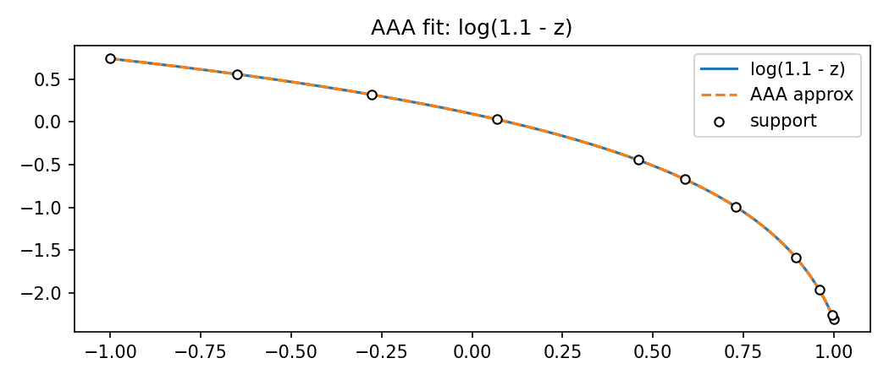
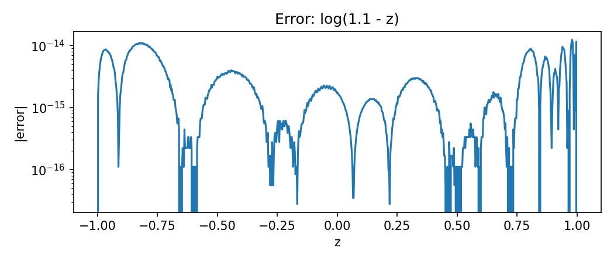
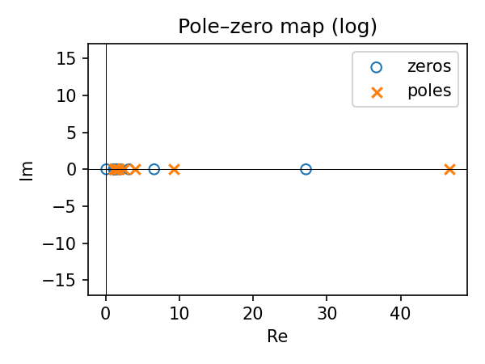
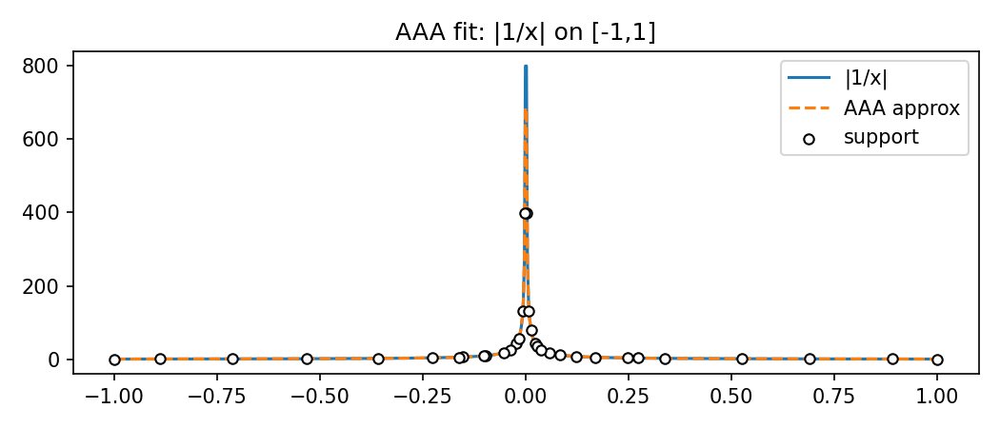
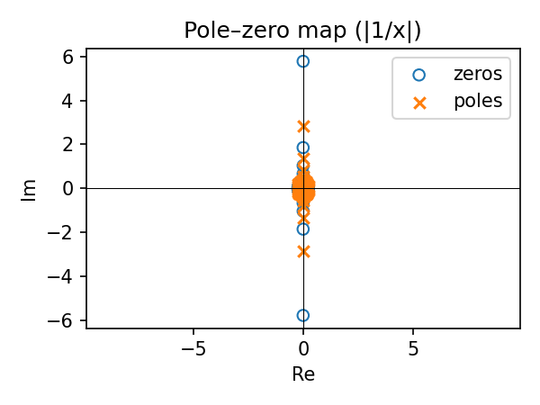
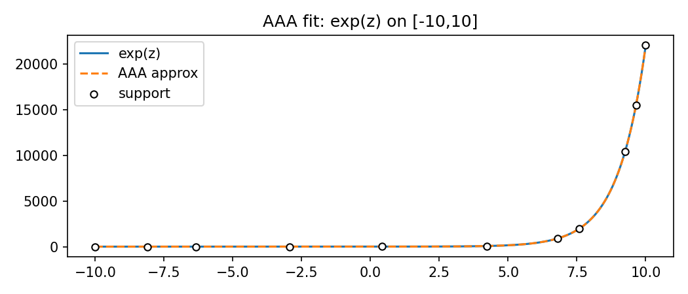
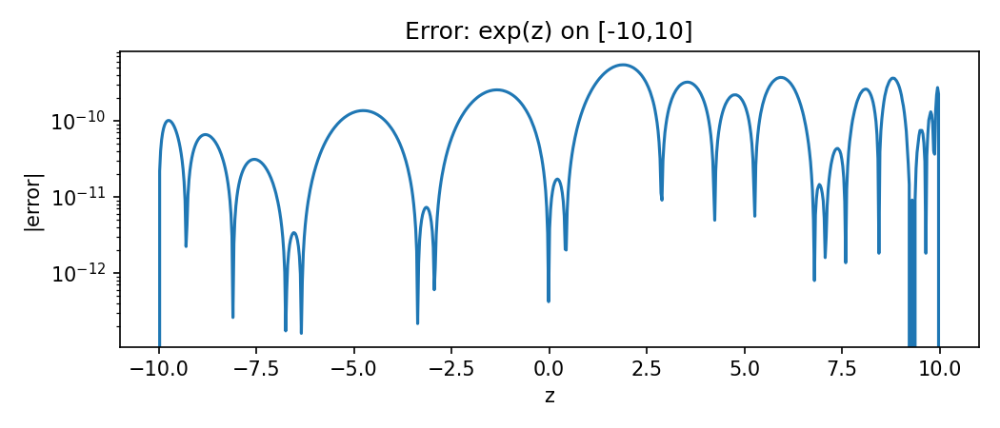
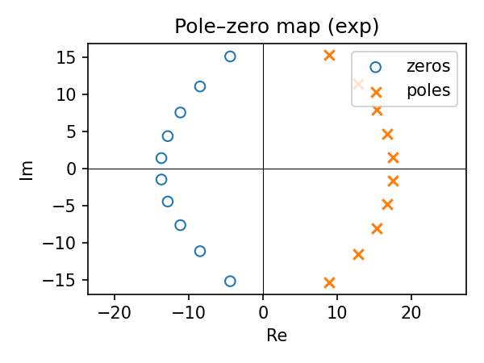
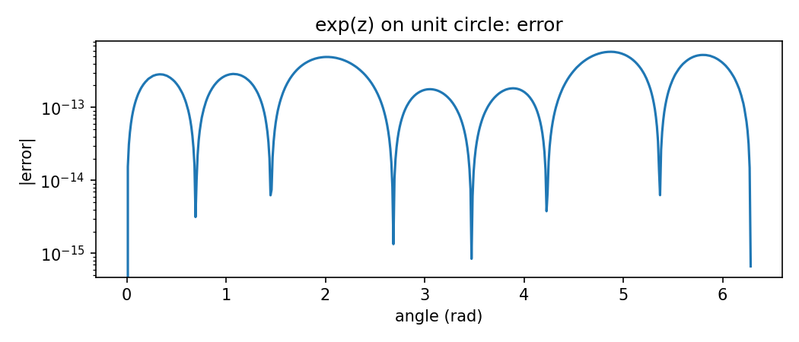
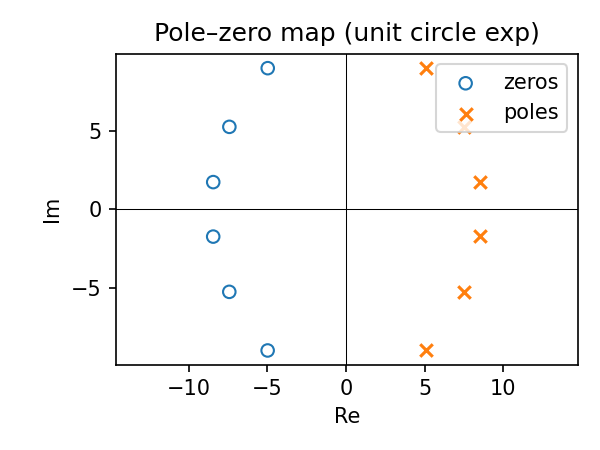

#  AAA Algorithm

## Problem Description
The paper addresses the problem of **rational approximation**: constructing a low-degree rational function
$$
r(z) = \frac{p(z)}{q(z)}
$$
that approximates a given function or dataset \( f(z) \) over a domain. Traditional polynomial approximations often fail for functions with poles, sharp gradients, or those defined on disconnected regions.

## Method Overview

### 1. Barycentric form
The AAA algorithm expresses the rational approximation in **barycentric form**:
$$
r(z) = \frac{\sum_{j=1}^{m} \frac{w_j f_j}{z - z_j}}{\sum_{j=1}^{m} \frac{w_j}{z - z_j}}, \quad \forall z \in Z
$$
where:
- $z_j$ are selected **support points**,
- $f_j = f(z_j)$,
- $w_j$ are complex weights to be determined,
- $Z^{(m)} = \{z_1, z_2, \dots, z_m\}$ is the set of support points.

#### Properties of Barycentric Form
1. There are no poles at the points $ z_j $ when $ w_1, \dots, w_m $ are nonzero.
2. If $ z_j $ is a support point, then $ f(z_j) = r(z_j) $.

### 2. Minimizing the Approximation Error Using SVD
Given support points $ Z^{(m)} = \{z_1, z_2, \dots, z_m\} $ and the remaining points $ Z^{(M-m)} = Z \setminus Z^{(m)} $.

#### 2-1. Minimization Problem
The goal is to minimize the approximation error:
$$
\min \| f(z) - r(z) \| = \min \left\| f(z) \sum_{j=1}^{m} \frac{w_j}{z - z_j} - \sum_{j=1}^{m} \frac{w_j f_j}{z - z_j} \right\|, \quad z \in Z^{(M-m)}
$$
This is equivalent to:
$$
\min \| A w \|, \quad \| w \| = 1
$$
where the matrix \( A \) is:
$$
A = \begin{pmatrix}
\frac{F^{(M-m)}_1 - f_1}{Z^{(M-m)}_1 - z_1} & \cdots & \frac{F^{(M-m)}_1 - f_m}{Z^{(M-m)}_1 - z_m} \\
\vdots & \ddots & \vdots \\
\frac{F^{(M-m)}_{M-m} - f_1}{Z^{(M-m)}_{M-m} - z_1} & \cdots & \frac{F^{(M-m)}_{M-m} - f_m}{Z^{(M-m)}_{M-m} - z_m}
\end{pmatrix},
$$
is an (M−m)×m matrix and $ F^{(M-m)} = \{ f(Z^{(M-m)}) \} $.

#### 2-2. Solving for $w$ via SVD
If $A = U \Sigma V^*$ is the **singular value decomposition (SVD)** of $A$, with $\Sigma = \operatorname{diag}(\sigma_1, \sigma_2, \dots, \sigma_r)$, assuming $(\sigma_1 \ge \sigma_2 \ge \cdots \ge \sigma_r \ge 0)$, then:
$$
w = v_{\min},
$$
where $v_{\min}$ is the last column of $V$.

Proof.
We aim to solve the optimization problem
$$
\min_{w \in \mathbb{C}^m, \; \|w\| = 1} \|A w\|_2.
$$
It is algebraically convenient to minimize the square:
$$
\min_{\|w\|=1} \|A w\|_2^2
= \min_{\|w\|=1} (A w)^{*}(A w)
= \min_{\|w\|=1} w^{*}(A^{*}A)w.
$$

Using the Singular Value Decomposition

Let
$$
A = U \Sigma V^{*},
$$
where $U \in \mathbb{C}^{(M-m) \times r}$ and $V \in \mathbb{C}^{m \times r}$ are (column-)orthonormal matrices, and
$$
\Sigma = \mathrm{diag}(\sigma_1, \dots, \sigma_r),
$$
with $\sigma_1 \ge \cdots \ge \sigma_r \ge 0$ and $r = \mathrm{rank}(A)$.

Substituting the SVD gives:
$$
A^{*}A = (U \Sigma V^{*})^{*} (U \Sigma V^{*})
       = V \Sigma^{*} U^{*} U \Sigma V^{*}
       = V \Sigma^2 V^{*}.
$$

Since $U^{*}U = I$ and $\Sigma$ is diagonal with real nonnegative entries,
$$
\Sigma^2 = \mathrm{diag}(\sigma_1^2, \dots, \sigma_r^2).
$$
Hence,
$$
w^{*}(A^{*}A)w = w^{*} V \Sigma^2 V^{*} w.
$$
Define
$$
y = V^{*} w.
$$
Because $V$ is unitary, $\|y\| = \|w\| = 1$.  
Then
$$
w^{*}(A^{*}A)w = y^{*} \Sigma^2 y
                = \sum_{j=1}^{r} \sigma_j^2 |y_j|^2.
$$

We must minimize this sum under $\|y\|=1$.  
Clearly, the smallest value is achieved by concentrating all weight on the smallest coefficient, i.e., $y = e_r = (0, \dots, 0, 1)^{T}$, corresponding to $\sigma_r$.

Thus, the minimal value is $\sigma_r^2$, and the corresponding optimal vector is
$$
w = V y = V e_r,
$$
which is the last column of $V$. $\Box$

### 3. Removing numerical Froissart doublets
#### 3.1 Locating Poles
The denominator of the rational function is
$$
d(z) = \sum_{j=1}^{m} \frac{w_j}{z - z_j}.
$$
The poles of $r(z)$ are defined as the zeros of $d(z)$:
$$
d(p_k) = 0, \qquad k = 1, \dots, m-1.
$$
Since $d(z)$ is a rational function with $(m-1)$ zeros, it can be written as
$$
d(z) = \frac{q(z)}{\prod_{j=1}^{m} (z - z_j)},
$$
where $q(z)$ is a polynomial of degree $(m-1)$.
Thus, the poles $p_k$ are the roots of $q(z)$:
$$
q(p_k) = 0.
$$
#### 3.2 Detecting Froissart Doublets
Near a pole $p_k$, the rational function can be locally expanded as
$$
r(z) = \frac{c_k}{z - p_k} + \text{regular terms},
$$
where $c_k$ is the residue of $r(z)$ at $p_k$.
By complex analysis, the residue is given by
$$
c_k = \lim_{z \to p_k} (z - p_k) r(z)
    = \frac{n(p_k)}{d'(p_k)}.
$$

Substituting $n(z)$ and $d(z)$:
$$
n(z) = \sum_{j=1}^{m} \frac{w_j f_j}{z - z_j}, 
\qquad
d(z) = \sum_{j=1}^{m} \frac{w_j}{z - z_j},
$$
$$
d'(z) = -\sum_{j=1}^{m} \frac{w_j}{(z - z_j)^2}.
$$

Hence, the explicit residue formula is 
$$
c_k = 
\frac{\displaystyle \sum_{j=1}^{m} \frac{w_j f_j}{p_k - z_j}}
     {\displaystyle -\sum_{j=1}^{m} \frac{w_j}{(p_k - z_j)^2}}.
$$
Thus, if $c_k \approx 0$, then $p_k$ is a Froissart doublet.

#### 3.3 Remove Froissart doublets
A pole $p_k$ is considered spurious if its residue magnitude satisfies
$$
|c_k| < \varepsilon ,
$$
where typically $\varepsilon = 10^{-13}$.

Such poles are removed by deleting the support point $z_j$
closest to $p_k$ and recomputing the barycentric weights $w_j$
via the SVD-based procedure.

### 4. AAA algorithm
```text
FUNCTION AAA(f_values, z_points, tol, m_max)
# Input:
#   f_values: Function samples f(z_i) at given points z_points (length M)
#   z_points: Sample points z_i in complex or real domain
#   tol: Error tolerance for stopping (e.g., 1e-13)
#   m_max: Maximum number of support points allowed
# Output:
#   r_function: Rational approximation r(z) = n(z)/d(z)
#   support_points: Selected support points z_j
#   weights: Barycentric weights w_j

Step 0: Initialization
residual <- f_values
support_indices <- EMPTY_LIST()
approximation <- ZERO_VECTOR(length(f_values))

Step 1: Iterative greedy selection of support points
FOR m FROM 1 TO m_max DO
    # (1a) Choose new support point where current residual is largest
    j_max <- ARG_MAX(|f_values - approximation|)
    APPEND(support_indices, j_max)

    # (1b) Define support and test sets
    z_supp <- z_points[support_indices]
    f_supp <- f_values[support_indices]
    test_indices <- SET_DIFFERENCE(ALL_INDICES, support_indices)
    z_test <- z_points[test_indices]
    f_test <- f_values[test_indices]

    # (1c) Construct Cauchy and Loewner matrices
    C <- 1 / (z_test[:,None] - z_supp[None,:])     # (M−m)×m
    A <- (f_test[:,None])*C - C*(f_supp[None,:])   # Loewner matrix

    # (1d) Compute barycentric weights via SVD
    U, Σ, Vh <- SVD(A)
    w <- CONJ_TRANSPOSE(Vh)[:, -1]  # right singular vector of smallest singular value

    # (1e) Form new rational approximation in barycentric form
    C_all <- 1 / (z_points[:,None] - z_supp[None,:])
    numerator <- C_all @ (w * f_supp)
    denominator <- C_all @ w
    approximation <- numerator / denominator

    # (1f) Check convergence
    error <- MAX(|f_values - approximation|)
    IF error < tol * MAX(|f_values|) THEN
        BREAK
    END IF
END FOR

# Step 2: Cleanup (remove spurious pole-zero pairs)
CALL CLEANUP(z_supp, w, f_supp)

# Step 3: Return rational function as callable closure
DEFINE r_function(z):
    C_eval <- 1 / (z[:,None] - z_supp[None,:])
    RETURN (C_eval @ (w * f_supp)) / (C_eval @ w)
END DEFINE

RETURN r_function, z_supp, w
END FUNCTION
```

## Small-scale implementation and experiments

This section demonstrates the core idea of AAA on a few tiny problems and compares the optional cleanup step. The goal isn’t to reproduce full experiments, but to show we can implement and apply the method in practice.

### Minimal AAA driver (compact Python)

The snippet below implements a compact AAA loop in barycentric form plus a helper to convert to numerator/denominator polynomials (for poles/residues). It’s intentionally short and prioritizes clarity over micro-optimizations.

```python
import numpy as np
from numpy.linalg import svd

def aaa_fit(F, Z, tol=1e-12, mmax=60, verbose=False):
    F = np.asarray(F, dtype=complex)
    Z = np.asarray(Z, dtype=complex)
    M = len(Z)
    R = np.zeros_like(F)
    S = []
    errs = []

    for m in range(1, mmax + 1):
        jmax = np.argmax(np.abs(F - R))
        S.append(jmax)
        Zs, Fs = Z[S], F[S]

        J = np.setdiff1d(np.arange(M), S)
        Zj, Fj = Z[J], F[J]
        C = 1.0 / (Zj[:, None] - Zs[None, :])
        A = Fj[:, None] * C - C * Fs[None, :]
        _, _, Vh = svd(A, full_matrices=False)
        w = Vh.conj().T[:, -1]

        # Evaluate on full grid and enforce interpolation at support points
        C_all = 1.0 / (Z[:, None] - Zs[None, :])
        R = (C_all @ (w * Fs)) / (C_all @ w)
        R[S] = Fs
        err = np.max(np.abs(F - R))
        errs.append(err)
        if verbose:
            print(f"Iter {m:2d}: max|err| = {err:.3e}")
        if err < tol * np.max(np.abs(F)):
            break
    return Zs, Fs, w, errs

def barycentric_to_poly(Zs, Fs, w):
    """Return numerator/denominator coefficients of n(z)/d(z)."""
    p = np.poly(Zs)                 # prod (z - z_k)
    num = np.zeros(len(Zs), dtype=complex)
    den = np.zeros(len(Zs), dtype=complex)
    for j in range(len(Zs)):
        qj, _ = np.polydiv(p, np.array([1.0, -Zs[j]]))
        den += w[j] * qj
        num += w[j] * Fs[j] * qj
    return num, den

def residues_at_poles(num, den):
    """Compute residues c_k = n(p_k) / d'(p_k) at poles p_k (roots of den)."""
    poles = np.roots(den)
    num_p, den_p = np.poly1d(num), np.poly1d(den)
    dprime = np.polyder(den_p)
    res = num_p(poles) / dprime(poles)
    return poles, res

def rf_eval(z, Zs, Fs, w, tol=1e-12):
    z = np.atleast_1d(z)
    C = 1.0 / (z[:, None] - Zs[None, :])
    dist = np.abs(z[:, None] - Zs[None, :])
    idx = dist.argmin(axis=1)
    hit = dist[np.arange(len(z)), idx] < tol
    num = C @ (w * Fs)
    den = C @ w
    out = num / den
    out[hit] = Fs[idx[hit]]  # enforce interpolation for stability
    return out
```


### Experiment 1: Real-valued benchmarks on [−1, 1] and [−10, 10]

```python
# log(1.1 - z) on [-1,1]
Z1 = np.linspace(-1, 1, 400)
F1 = np.log(1.1 - Z1)
Zs1, Fs1, w1, _ = aaa_fit(F1, Z1, tol=1e-12)
zz1 = np.linspace(-1, 1, 800)
err1 = np.max(np.abs(np.log(1.1 - zz1) - rf_eval(zz1, Zs1, Fs1, w1)))
print(f"log(1.1 - z): support points = {len(Zs1)}, max|error| ≈ {err1:.3e}")

# |1/x| on [-1,1] (avoid 0 exactly for the reference curve)
Z2 = np.linspace(-1, 1, 400)
Z2[np.isclose(Z2, 0)] = 1e-12
F2 = np.abs(1.0 / Z2)
Zs2, Fs2, w2, _ = aaa_fit(F2, Z2, tol=1e-12)
zz2 = np.linspace(-1, 1, 800)
zz2[np.isclose(zz2, 0)] = 1e-12
err2 = np.max(np.abs(np.abs(1.0/zz2) - rf_eval(zz2, Zs2, Fs2, w2).real))
print(f"|1/x|: support points = {len(Zs2)}, max|error| (away from 0) ≈ {err2:.3e}")

# exp(z) on [-10,10]
Z3 = np.linspace(-10, 10, 400)
F3 = np.exp(Z3)
Zs3, Fs3, w3, _ = aaa_fit(F3, Z3, tol=1e-12)
zz3 = np.linspace(-10, 10, 800)
err3 = np.max(np.abs(np.exp(zz3) - rf_eval(zz3, Zs3, Fs3, w3).real))
print(f"exp(z): support points = {len(Zs3)}, max|error| ≈ {err3:.3e}")
```

In our notebook runs, we observed representative support-point counts: log(1.1 − z): 11, |1/x|: 33, exp(z): 11. Errors are typically in the 10^{-12}–10^{-14} range on these grids (except near the removable singularity at z = 0 for |1/x| where the reference itself diverges).

Corresponding figures:

- log(1.1 − z):
    - Fit: 
    - Error: 
    - Pole–zero map: 

- |1/x| on [−1,1]:
    - Fit: 
    - Error: 
    - Pole–zero map: 

- exp(z) on [−10,10]:
    - Fit: 
    - Error: 
    - Pole–zero map: 

### Experiment 2: exp(z) on the unit circle (complex domain)

We approximate f(z) = exp(z) sampled on the unit circle z = e^{iθ}. The same AAA machinery applies in the complex plane; evaluation and pole–zero extraction use the barycentric form and the polynomial conversion helper.

```python
# Unit-circle complex example
theta = np.linspace(0, 2*np.pi, 200)
Zc = np.exp(1j * theta)
Fc = np.exp(Zc)

# Fit and validate
Zs_uc, Fs_uc, w_uc, _ = aaa_fit(Fc, Zc, tol=1e-12, mmax=80)
theta_t = np.linspace(0, 2*np.pi, 600)
Zt = np.exp(1j * theta_t)
F_true_uc = np.exp(Zt)
F_approx_uc = rf_eval(Zt, Zs_uc, Fs_uc, w_uc)
max_err = np.max(np.abs(F_true_uc - F_approx_uc))
print(f"Unit-circle exp(z): support points = {len(Zs_uc)}, max|error| ≈ {max_err:.3e}")

# Optional: pole–zero map via barycentric_to_poly
num_uc, den_uc = barycentric_to_poly(Zs_uc, Fs_uc, w_uc)
p_uc = np.roots(den_uc)
z_uc = np.roots(num_uc)
```

Corresponding figures:

- Error vs angle: 
- Pole–zero map: 


## Summary and conclusion

Strengths

- High-accuracy, low-degree rational fits:
Excels for functions analytic except at isolated poles or removable singularities.
The same algorithm handles both real and complex domains seamlessly.

- Interpretability:
 Extraction of poles, zeros, and residues provides insight and diagnostic capability.
The optional cleanup step enhances robustness when fits become aggressive.


Limitations and costs

- Computational cost: Each iteration builds a Loewner matrix (size roughly $(M−m)×m)$ and performs an SVD; overall cost grows like $O(M m^2)$ and can be noticeable for large M. Pole/zero extraction via polynomial conversion also grows in cost and can be ill-conditioned for very large m.
- A sufficiently rich yet not excessive sample grid is provided; AAA is data-driven and benefits from covering the domain uniformly and near difficult regions.

Possible improvements and extensions


- Employ randomized or truncated SVD for faster linear algebra.
- Use preconditioning or scaling to mitigate ill-conditioning.
- Parallelize or batch SVD computations for very large datasets.


